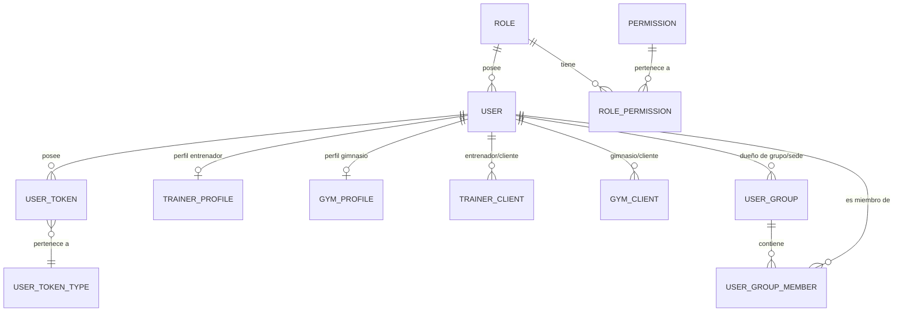

# 📋 Clasificación y Documentación Detallada del Repositorio

> **Repositorio:** `traynova.auth.back` (`gestrym-auth`)  
> **Propósito:** Microservicio backend de Autenticación, Autorización (RBAC) y Gestión de Identidades/Organizaciones.  
> **Arquitectura:** Hexagonal / Ports and Adapters en Go.

---

## 1. 🗂️ Clasificación General de Archivos y Directorios

A continuación se clasifica la totalidad de los componentes existentes en la raíz y subdirectorios del proyecto:

| Categoría | Archivo / Directorio | Descripción y Propósito |
| :--- | :--- | :--- |
| **Punto de Entrada** | `main.go` | Inicia la ejecución llamando a `src.RunServer()` para bootstrapear la aplicación. |
| **Punto de Entrada** | [src/app.go](file:///Users/jhonnier.gomez/Documents/Personal/traynova.auth.back/src/app.go) | Configura el servidor Gin, inicializa Viper, conecta PostgreSQL vía GORM, registra Swagger y levanta las rutas. |
| **Configuración** | `.env` / `.env.example` | Variables de entorno (puertos, credenciales DB, clave JWT, URLs externas de notificaciones). |
| **Configuración** | [go.mod](file:///Users/jhonnier.gomez/Documents/Personal/traynova.auth.back/go.mod) / `go.sum` | Gestión de módulos Go (versión 1.25.0) y árbol de dependencias de terceros. |
| **Despliegue** | [Dockerfile](file:///Users/jhonnier.gomez/Documents/Personal/traynova.auth.back/Dockerfile) | Definición multi-stage para empaquetar la aplicación en una imagen de producción optimizada. |
| **Despliegue** | `deployment/env_local.yaml` | Configuración adicional de entorno local usada por Viper. |
| **Documentación** | [README.md](file:///Users/jhonnier.gomez/Documents/Personal/traynova.auth.back/README.md) | Documentación principal de presentación del proyecto para GitHub. |
| **Documentación** | [IA_MEMORY.md](file:///Users/jhonnier.gomez/Documents/Personal/traynova.auth.back/IA_MEMORY.md) | Registro de arquitectura, decisiones técnicas, contexto y cambios históricos para asistentes de IA. |
| **Documentación** | [GUIA_FRONT.md](file:///Users/jhonnier.gomez/Documents/Personal/traynova.auth.back/GUIA_FRONT.md) | Guía técnica y de contratos API orientada a los desarrolladores de frontend / móvil. |
| **Documentación** | `docs/` | Archivos auto-generados por Swagger (`docs.go`, `swagger.json`, `swagger.yaml`). |
| **Código Fuente** | `src/common/` | Capa transversal (infraestructura compartida, middlewares, modelos DB, utilidades, rutas). |
| **Código Fuente** | `src/core/` | Capa de dominio y aplicación organizada por Bounded Contexts (Auth, Login, JWT, Roles, etc.). |

---

## 2. 🧩 Desglose de la Capa Core (`src/core/`)

Cada subdirectorio en `src/core/` representa un módulo de negocio independiente diseñado bajo arquitectura hexagonal (dividido en `app`, `domain` e `infra`):

### 2.1. 🔑 `src/core/auth/` (Módulo Principal)
Es el núcleo del sistema de gestión de usuarios.
- **`domain/`**:
  - `ports/`: Define la interfaz `IAuthRepository` (contrato de persistencia) e `IAuthService` (contrato de servicios).
  - `structs/`: Contiene los DTOs de petición y respuesta (`RegisterRequest`, `UpdateUserRequest`, `PasswordRecoveryRequest`, `PasswordResetRequest`, `GetUserResponse`, etc.).
- **`app/`**:
  - `auth_service.go`: Implementa la lógica de negocio completa: registro público e interno, validación de contraseñas, envío de emails de confirmación/recuperación, administración de perfiles Gym/Trainer, soft delete y gestión de grupos/sedes.
- **`infra/`**:
  - `controllers/`: Adaptadores HTTP (`AuthPublicController`, `AuthPrivateController`) que manejan las peticiones REST.
  - `repositories/`: Adaptador GORM (`authRepository`) que interactúa directamente con PostgreSQL.

### 2.2. 🔓 `src/core/login/`
Se encarga exclusivamente de la autenticación de usuarios existentes.
- **`app/login_service.go`**: Verifica credenciales (email/password), comprueba si el usuario está activo y si ha confirmado su correo, e invoca el servicio JWT para emitir los tokens de acceso.
- **`infra/controllers/login_controller.go`**: Expone el endpoint público `POST /public/login`.

### 2.3. 🎟️ `src/core/jwt/`
Servicio especializado en la gestión de JSON Web Tokens.
- **`app/jwt_service.go`**: Emisión de tokens firmados HMAC con datos de sesión (`user_id`, `role_id`, `access_level_id`) y registro de tokens en la base de datos para seguimiento y revocación.

### 2.4. 🏷️ Módulos de Catálogo y Permisos
- `src/core/roles/`: Gestión del catálogo de roles de usuario (Cliente, Coach, Gym, Admin).
- `src/core/permissions/`: Definición y asignación de permisos sobre recursos del sistema.
- `src/core/actions/`: Catálogo de acciones (Crear, Leer, Actualizar, Eliminar, etc.).
- `src/core/access_levels/`: Definición de niveles de acceso contextuales.
- `src/core/token_types/`: Tipos de token en el sistema (ej. Activación de cuenta, Recuperación de contraseña, Refresh token).

---

## 3. 🛠️ Desglose de la Capa Common (`src/common/`)

Componentes compartidos utilizados por múltiples módulos core:

### 3.1. ⚙️ `src/common/config/`
- **`env_loader.go`**: Carga de variables de entorno mediante `viper`. Lee `.env` o variables del sistema operativo con valores por defecto.

### 3.2. 🛡️ `src/common/middleware/`
- **`JWTModdleware.go`**: Middleware que intercepta peticiones HTTP, extrae el token `Bearer` del header `Authorization`, valida la firma con `JWT_KEY` e inyecta en el contexto de Gin los valores `user_id`, `role_id` y `access_level_id`.
- **`RoleMiddleware.go`**: Middleware de autorización que restringe el acceso a endpoints evaluando el `role_id` presente en el contexto (ej. `RequireRoles(4)` para superadministradores).
- **`CORSMiddleware.go`**: Habilita cabeceras de Cross-Origin Resource Sharing para peticiones desde clientes Web.

### 3.3. 🗄️ `src/common/models/`
Contiene todas las estructuras de datos mapeadas a PostgreSQL con GORM:
- **`User`**: Información fundamental de la identidad (Email, Password hash, FullName, Prefix, Phone, IsActive, EmailConfirmed, RoleID).
- **`Role` / `Permission` / `RolePermission`**: Esquema de Control de Acceso Basado en Roles (RBAC).
- **`UserToken` / `UserTokenType`**: Registro y auditoría de tokens generados en la plataforma.
- **`TrainerProfile` / `GymProfile`**: Información extendida para perfiles de negocio (colores primarios/secundarios, código de referido, workstation, ciudad, departamento, país, avatar).
- **`TrainerClient` / `GymClient`**: Tabla de enlace que mapea las relaciones de negocio entre entrenadores, gimnasios y sus clientes asignados.
- **`UserGroup` / `UserGroupMember`**: Gestión de sedes o grupos de usuarios (clientes/entrenadores) pertenecientes a un gimnasio o entrenador.

### 3.4. 🛣️ `src/common/routes/`
- **`ServerRoutesDefinition.go`**: Centraliza el registro de todas las rutas HTTP del servidor divididas en tres grupos principales:
  1. **Rutas Públicas (`/public/`)**: Accesibles sin autenticación (registro, login, confirmación de email, validación de token, recuperación de clave).
  2. **Rutas Privadas (`/private/`)**: Requieren token JWT válido (gestión de usuarios, clientes, sedes/grupos, perfiles).
  3. **Rutas Protegidas (`/protected/`)**: Requieren token JWT y rol administrativo específico.

### 3.5. 📨 `src/common/shared/`
- **`notification_service.go`**: Cliente HTTP desacoplado que envía peticiones al microservicio externo de notificaciones pro usando plantillas estructuradas JSON (`EMAIL`, `account_confirmation`, `recovery_password`) y autenticación por `X_API_KEY`.

### 3.6. 🧰 `src/common/utils/`
- Encriptación de contraseñas con `bcrypt`, constantes de roles, formateadores de respuesta JSON uniforme y utilidades generales.

---

## 4. 🗃️ Modelo de Datos y Relaciones



---

## 5. 🔄 Explicación de los Flujos Clave del Sistema

### 5.1. Flujo de Registro y Confirmación de Email
```text
[Cliente/Front] ---> POST /public/auth/register
                       │
                       ▼
                 [AuthService]
                       │
                       ├─► Crea Usuario (is_active: false, email_confirmed: false)
                       ├─► Si es Gym/Trainer: Guarda GymProfile / TrainerProfile
                       ├─► Genera Token JWT de Activación (UserToken)
                       └─► Llama NotificationService (HTTP POST /send con plantilla 'account_confirmation')
                                 │
                                 ▼
                         [Correo Electrónico enviado con Enlace]
                                 │
                                 ▼
                 GET /public/auth/confirm?token=...
                       │
                       ▼
                 [AuthService] ---> (is_active: true, email_confirmed: true)
```

### 5.2. Flujo de Autenticación y Autorización (Login)
```text
[Cliente/Front] ---> POST /public/login (Email, Password)
                       │
                       ▼
                 [LoginService]
                       │
                       ├─► Busca usuario por email
                       ├─► Verifica hash de contraseña con Bcrypt
                       ├─► Valida is_active == true y email_confirmed == true
                       └─► Emite Access Token JWT (con user_id, role_id, access_level_id)
                                 │
                                 ▼
                 [Peticiones Subsiguientes] ---> Authorization: Bearer <Token>
                                 │
                                 ▼
                         [JWTModdleware] ---> Setea contexto Gin (user_id, role_id)
```

---

## 6. 📊 Resumen de Estado del Repositorio

- **Compilación:** Pasa exitosamente con `go build ./...`.
- **Integridad de Arquitectura:** Las capas de dominio, aplicación e infraestructura están estrictamente desacopladas.
- **Microservicios Vinculados:** Se comunica vía HTTP/JSON con el microservicio de Notificaciones.
- **Documentación Swagger:** Generada y disponible en `/swagger/index.html`.
